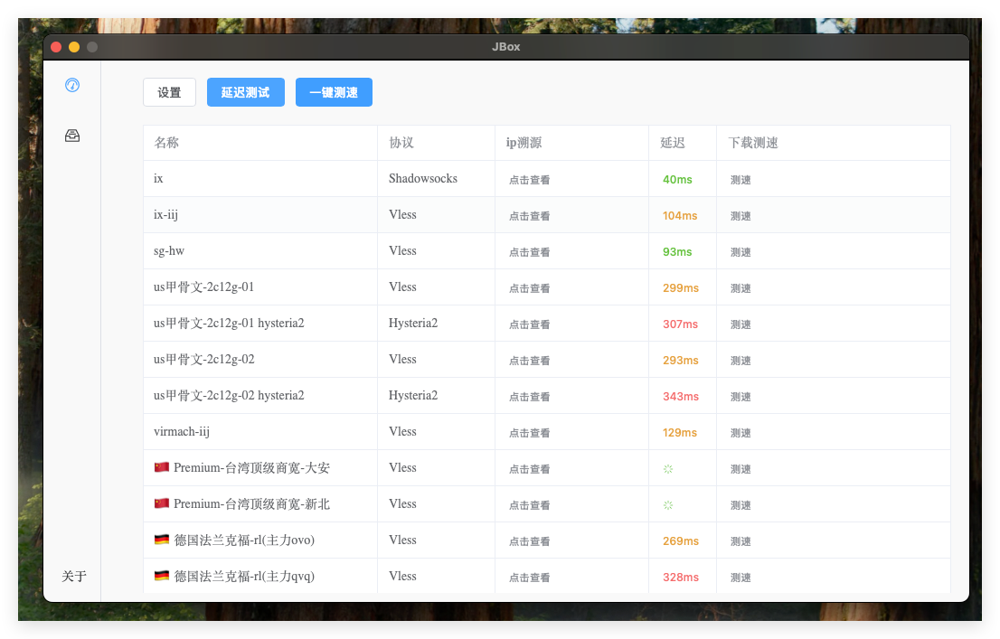
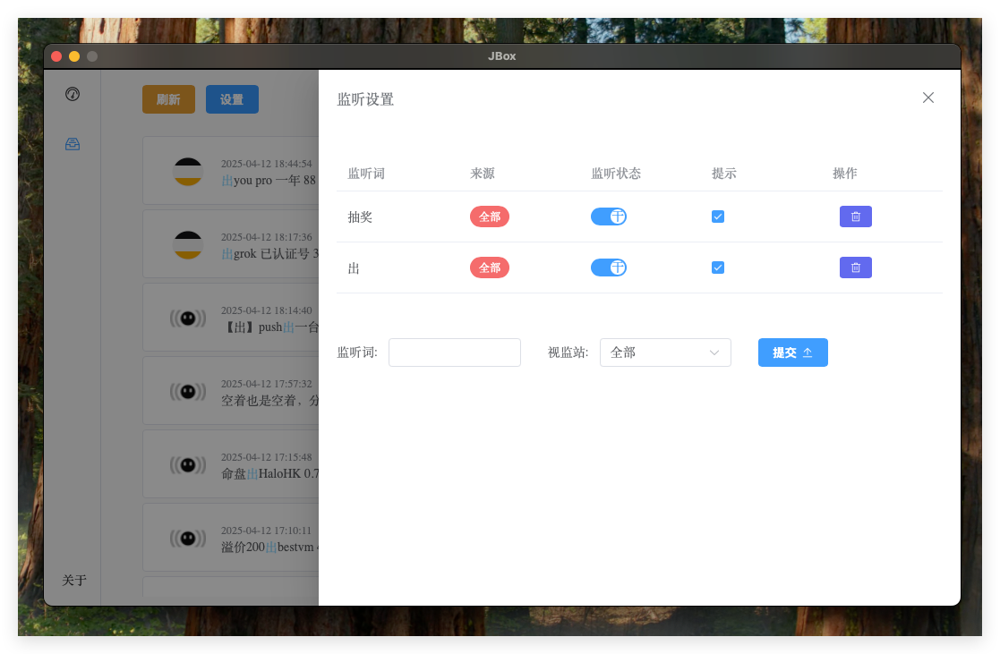
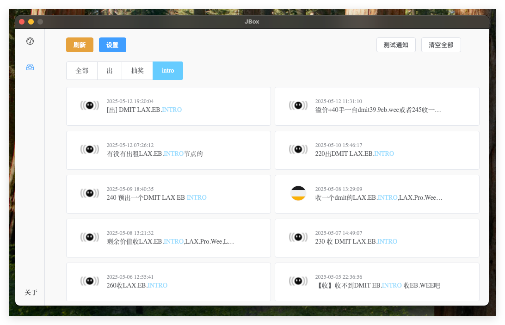
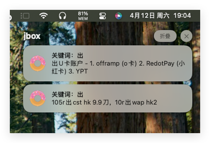

# 功能介绍

本工具是面向Mjj社区的一个小助手

目前功能有：
## clash测速
> 本功能和应对防火长城的封锁无关，主要提供服务器和本机之间的测速没有任何代理功能。

1. 基于clash协议的本地到服务器网络测速
2. IP溯源

主界面展示

## 论坛关键词监听
1. 提供关键词监听功能目前支持 ns，hostloc，v2ex，linux.do
2. 集成mac和win的系统提示

设置界面展示

主页面展示

消息提示

# 更新

## 2025.4.12
* 初始化仓库
* 增加论坛助手功能
* 增加clash测速功能

# 已知问题
* 目前测试版本将于2025年6月24日到期，后续会添加自动更新
* hostloc监听可以会滞后一会